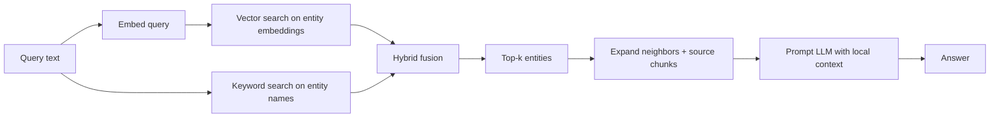
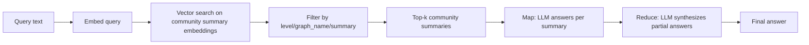
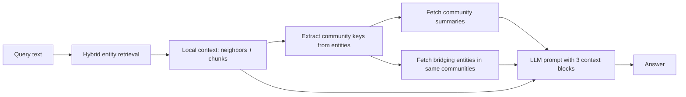

# Search Under the Hood

This document explains what actually happens when you call `GraphRAG.search(...)`. It is written for people who already know how to *use* the SDK and now want to understand the mechanics underneath.

---

## In one sentence

Recon-GraphRAG turns your question into **vector and keyword signals**, retrieves a focused slice of the graph, and asks an LLM to answer from that slice. The three search modes differ only in *which* slice they retrieve.

---

## The graph you are searching

Before search can work, the graph must already contain:

| Node | What it represents | Key properties |
|------|--------------------|----------------|
| `__Entity__` | Extracted people, places, concepts, etc. | `name`, `description`, `embedding` |
| `Chunk` | A text chunk from the original documents | `text`, `embedding` |
| `Document` | The source document | metadata |
| `Community` | A cluster of related entities | `summary`, `embedding`, `level` |

And the relationships:

- `(Chunk)-[:FROM_CHUNK]->(__Entity__)` — links an entity back to its evidence text.
- `(__Entity__)-[:IN_COMMUNITY]->(Community)` — places an entity in a community.
- `(Community)-[:PARENT_COMMUNITY]->(Community)` — builds the community hierarchy.

These are produced by [`GraphBuilderPipeline`](recon_graphrag/pipelines/graphrag_pipeline.py) and [`CommunityPipeline`](recon_graphrag/communities/pipeline.py). Search is essentially read-only on top of this prepared graph.

---

## Query = one string, two signals

The query string is **never parsed into entities, relations, or sub-questions**. It is used as-is in two parallel searches:

1. **Vector signal** — the entire query is embedded into a dense vector, then used for approximate nearest-neighbor (ANN) search.
2. **Keyword signal** — the entire query text is passed to a full-text index on entity names.

```text
User query
    ├── embed(query) ──────► vector_search(index, query_vector)
    └── text(query) ───────► keyword_search(index, query_text)
```

This happens in [`HybridEntityRetriever.search()`](recon_graphrag/retrieval/hybrid.py).

### Keyword query handling

- **Neo4j**: the raw query goes into `db.index.fulltext.queryNodes(...)`. The underlying Lucene index interprets quotes, `+`, `-`, etc. if the user supplies them.
- **Memgraph**: the query is first rewritten into a Tantivy query. Phrases are preserved, remaining tokens are escaped and joined with `OR`. So `"Christopher Nolan movies"` becomes something like `"Christopher" OR "Nolan" OR "movies"`.

There is no stemming, synonym expansion, stop-word removal, or entity extraction.

---

## Hybrid fusion: merging vector and keyword results

The two ranked lists come back from the database. The retriever normalizes each list independently to `[0, 1]`, then combines them per entity.

| Ranker | Score formula |
|--------|---------------|
| `naive` (default) | `score = max(vector_score, keyword_score)` |
| `linear` | `score = alpha * vector_score + (1 - alpha) * keyword_score` |

The final entities are sorted by this combined score, with entity ID as a tie-breaker, and only `top_k` survive.

You can control how deep the first retrieval goes with `effective_search_ratio`. The database is asked for `top_k * effective_search_ratio` candidates, because filtering by label or properties happens *after* the index call.

---

## Local search: entity-centric subgraph retrieval

Best for: *specific questions about named entities*.



What happens:

1. Query is embedded and run through keyword search on `__Entity__`.
2. Results are fused and reduced to `top_k` entities.
3. For each entity, the graph store runs a context query that:
   - collects one-hop neighbors (excluding `Chunk`, `Document`, and `Community`),
   - collects the source `Chunk` texts via `FROM_CHUNK`,
   - returns entity title, relationship strings, source snippets, and the hybrid score.
4. The context is formatted and sent to the LLM in one prompt.

The LLM only sees the matched entities and their immediate neighborhood. It does **not** see community summaries.

See [`LocalSearchRetriever`](recon_graphrag/retrieval/local.py) and the local retrieval query in [`retrieval/neo4j/queries.py`](recon_graphrag/retrieval/neo4j/queries.py).

---

## Global search: map-reduce over community summaries

Best for: *broad, thematic, corpus-wide questions*.



What happens:

1. The requested `level` is resolved (`"finest"` = 0, `"coarsest"` = highest stored level, `"all"` or `None` = no filter, or an exact integer).
2. Query is embedded and used to search the `community-embeddings` vector index.
3. The result is over-fetched and filtered by `graph_name`, `level`, and `summary IS NOT NULL`, then limited to `top_k` summaries.
4. **Map phase**: each summary is sent to the LLM with the question, producing one partial answer per community.
5. **Reduce phase**: all partial answers are concatenated and sent to the LLM with a synthesis prompt.

The final answer is the reduce output. The context attached to the result is the concatenated community summaries.

See [`GlobalSearchRetriever`](recon_graphrag/retrieval/global_search.py).

---

## DRIFT search: local + community bridging

Best for: *questions about specific entities that also need broader context*.



What happens:

1. Same hybrid entity retrieval as local search, but using the DRIFT context query, which also collects each entity’s `IN_COMMUNITY` relationships.
2. Unique `(community_id, level)` keys are extracted from the returned entities.
3. The target community level is resolved.
4. Community summaries are fetched for those keys, limited by `community_top_k`.
5. “Bridging entities” — other entities that belong to the same communities — are fetched with their intra-community relationships (hard limited to 50).
6. The LLM receives three formatted blocks:
   - specific findings from the entity subgraph,
   - broader community summaries,
   - related entities and their connections.

DRIFT is essentially: *find the entities, discover which communities they sit in, then pull the community reports and related concepts as extra framing.*

See [`DriftSearchRetriever`](recon_graphrag/retrieval/drift.py).

---

## Context expansion: what the LLM actually sees

The retriever does not send raw graph records to the LLM. It builds a readable context string.

### Local context format

For each matched entity:

```text
Finding: Nolan (Person)
Connections:
  Person: Nolan -[DIRECTED]-> Movie: Inception
  Person: Nolan -[DIRECTED]-> Movie: Interstellar
Evidence:
  Christopher Nolan directed Inception...
  Nolan's next film was Interstellar...
```

Source snippets are capped (up to 3 by default).

### DRIFT context format

Same as local, plus:

```text
=== Broader Context ===
Segment 12 (level 0):
This cluster centers on Christopher Nolan and his science-fiction films...

=== Related Entities ===
Related: [Movie] Inception
    Connected to: DIRECTED -> Nolan
    Connected to: ACTED_IN -> DiCaprio
```

### Global context format

```text
Report Segment 12 (level 0):
This cluster centers on Christopher Nolan and his science-fiction films...

Report Segment 15 (level 0):
This cluster covers Hans Zimmer's collaborations with major directors...
```

The map-reduce prompts then ask the LLM to answer from these report segments.

---

## Indexing that makes this fast

Search depends on these indexes, created by `IndexManager`:

| Index | Type | Indexed property | Used by |
|-------|------|------------------|---------|
| `entity-embeddings` | Vector | `__Entity__.embedding` | Local, DRIFT |
| `community-embeddings` | Vector | `Community.embedding` | Global, DRIFT |
| `chunk-embeddings` | Vector | `Chunk.embedding` | Not used by search modes directly |
| `entity-names` | Full-text / Text | `__Entity__.name` | Local, DRIFT |

Vector indexes use cosine similarity. Full-text / text indexes provide keyword relevance.

On **Neo4j** the procedures are `db.index.vector.queryNodes` and `db.index.fulltext.queryNodes`. On **Memgraph** they are `vector_search.search` and `text_search.search` (Tantivy-backed).

See:
- [`graphdb/neo4j/index_manager.py`](recon_graphrag/graphdb/neo4j/index_manager.py)
- [`graphdb/memgraph/index_manager.py`](recon_graphrag/graphdb/memgraph/index_manager.py)
- [`graphdb/neo4j/store.py`](recon_graphrag/graphdb/neo4j/store.py)
- [`graphdb/memgraph/store.py`](recon_graphrag/graphdb/memgraph/store.py)

---

## Community pipeline: the prerequisite

Global and DRIFT search cannot work until communities have been built. The pipeline is:

1. **Detect** — run Leiden community detection on the entity graph. The result is a hierarchy of community IDs from fine (`level = 0`) to coarse.
2. **Write** — create `Community` nodes and link entities with `IN_COMMUNITY` and communities with `PARENT_COMMUNITY`.
3. **Summarize** — for each community, collect its entities and intra-community relationships (or child-community summaries for higher levels), format as text, and ask an LLM to produce a summary.
4. **Embed** — embed each summary and store it on the `Community` node.

Only after step 4 does global search have vector-searchable community summaries.

See:
- [`communities/pipeline.py`](recon_graphrag/communities/pipeline.py)
- [`communities/neo4j/detection.py`](recon_graphrag/communities/neo4j/detection.py)
- [`communities/summarization.py`](recon_graphrag/communities/summarization.py)
- [`communities/embeddings.py`](recon_graphrag/communities/embeddings.py)

---

## What is NOT happening

It is useful to be explicit about the current limitations:

- **No query decomposition.** The query is not split into sub-questions or entities.
- **No entity linking.** The system does not recognize that `"Inception"` is a `Movie` node; it relies on vector and keyword similarity.
- **No re-ranking model.** Ranking is purely the hybrid fusion described above.
- **No multi-hop traversal.** Local and DRIFT only collect immediate neighbors and source chunks.
- **No recursive community walking.** Global uses one level at a time; it does not climb or descend the hierarchy during search.
- **Map phase is sequential.** Each community summary is sent to the LLM one after another, not in parallel.

If you need any of these behaviors, you would add them as a preprocessing layer or a new retriever.

---

## When to use each mode

| Mode | Use when | Retrieval focus |
|------|----------|-----------------|
| **Local** | The question names a specific entity or asks for a concrete fact. | Entities → neighbors → chunks |
| **Global** | The question is broad, thematic, or asks for an overview. | Community summaries → map-reduce |
| **DRIFT** | The question needs specific evidence plus broader context. | Entities + their communities + bridging entities |
